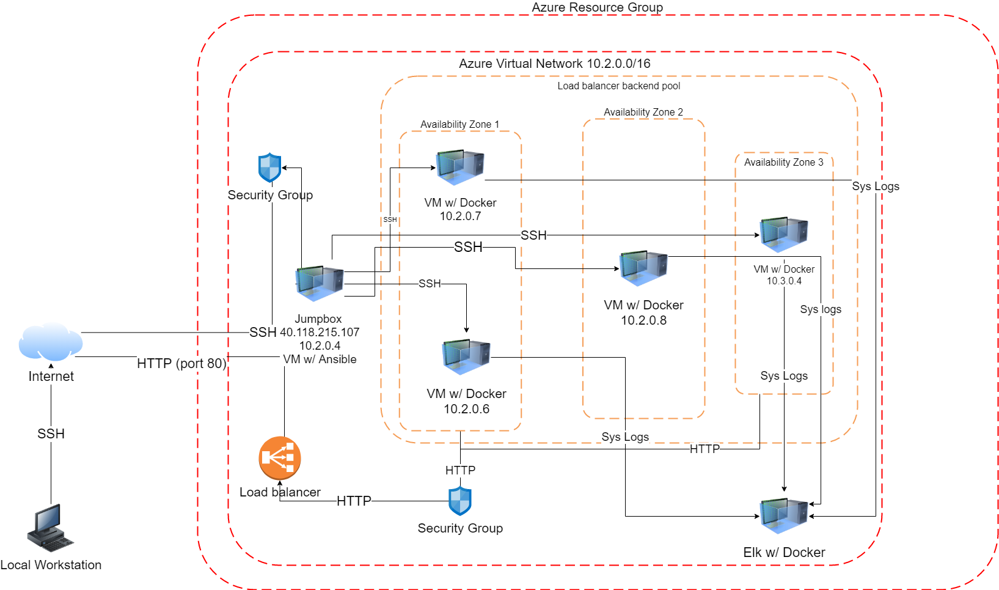

## Automated ELK Stack Deployment

The files in this repository were used to configure the network depicted below.

These files have been tested and used to generate a live ELK deployment on Azure. They can be used to either recreate the entire deployment pictured above. Alternatively, select portions of the Ansible file may be used to install only certain pieces of it, such as Filebeat.

  - _TODO: Enter the playbook file._

This document contains the following details:
- Description of the Topology
- Access Policies
- ELK Configuration
  - Beats in Use
  - Machines Being Monitored
- How to Use the Ansible Build

### Description of the Topology

The main purpose of this network is to expose a load-balanced and monitored instance of DVWA, the D*mn Vulnerable Web Application.

Load balancing ensures that the application will be highly efficient, in addition to restricting a Ddos attack to the network.
- Restricts the ability for a Ddod attack and allowing the servers to manage how much they're being used
- A Jumpbox allows for only one VM to be accessible from the internet. This also allows the other VM's to be restricted to who and what can change them. 

Integrating an ELK server allows users to easily monitor the vulnerable VMs for changes to security changes and system metrics.

The configuration details of each machine may be found below.

| Name     | Function | IP Address | Operating System |
|----------|----------|------------|------------------|
| Jump Box | Gateway  | 10.2.0.4   | Linux            |
| VM 1     |Web Server| 10.2.0.7   | Linux            |
| VM2      |Web Server| 10.2.0.6   | Linux            |
| ELK      |Monitoring| 10.3.0.4   | Linux            |

The machines on the internal network are not exposed to the public Internet. 

Only the Jumpbox machine can accept connections from the Internet. Access to this machine is only allowed from the following IP addresses: 76.105.171.155
Machines within the network can only be accessed by the Jumpbox.
ELK VM: 10.3.0.4

A summary of the access policies in place can be found in the table below.

| Name     | Publicly Accessible | Allowed IP Addresses |
|----------|---------------------|----------------------|
| Jump Box | Yes                 | 76.105.171.155       |
|  VM1     | no                  |  10.2.0.7            |
|  VM2     | no                  |  10.2.0.6            |
|  ELK     | no                  |  10.3.0.4            |

### Elk Configuration

Ansible was used to automate configuration of the ELK machine. No configuration was performed manually, which is advantageous because that limits the human error invovled. This automates the service.

The playbook implements the following tasks:
- Install Docker
- Install pip3
- Add memory
- Launch docker elk container

The following screenshot displays the result of running `docker ps` after successfully configuring the ELK instance.

![TODO: Update the path with the name of your screenshot of docker ps output]

### Target Machines & Beats
This ELK server is configured to monitor the following machines:
- 10.2.0.7
- 10.2.0.6
- 10.3.0.4

We have installed the following Beats on these machines:
- Metric Beat

These Beats allow us to collect the following information from each machine:
- Logs metrics of the virtual machines

### Using the Playbook
In order to use the playbook, you will need to have an Ansible control node already configured. Assuming you have such a control node provisioned: 

SSH into the control node and follow the steps below:
- Copy the playbook file to the Anisble Control Node.
- Update the playbook file to include the new target
- Run the playbook, and navigate to the target to check that the installation worked as expected.

_TODO: Answer the following questions to fill in the blanks:_
- _Which file is the playbook? Where do you copy it?_
- _Which file do you update to make Ansible run the playbook on a specific machine? How do I specify which machine to install the ELK server on versus which to install Filebeat on?_
- _Which URL do you navigate to in order to check that the ELK server is running?

